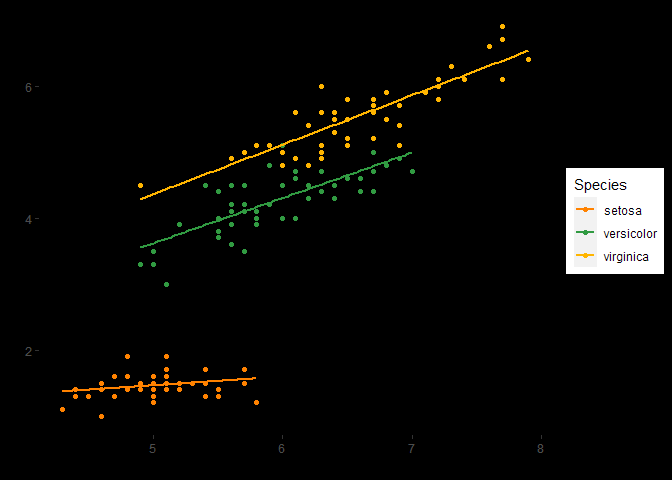

# asn

The **`asn`** package provides functions to use the brand identity of
the [American Society of Nephrology](https://asn-online.org) (ASN) in
data visualizations made in either `ggplot2` or `highcharter`. It also
provides some helper functions:

- [`pct_chg()`](https://asndataanalytics.github.io/asn/reference/pct_chg.md)
  and
  [`pct_norm()`](https://asndataanalytics.github.io/asn/reference/pct_norm.md)
  calculate percentage changes from either previous values or the first
  value in a series
- [`pct_fun()`](https://asndataanalytics.github.io/asn/reference/pct_fun.md)
  returns a summary count table for a vector including the percentage
  breakdowns in a easily readable format
- [`get_labs()`](https://asndataanalytics.github.io/asn/reference/get_labs.md)
  extracts the label attributes from an object. This is designed to pull
  the questions from the column names from a data frame extracted by
  `haven` from Qualtrics SPSS .sav files
- [`select_all()`](https://asndataanalytics.github.io/asn/reference/select_all.md)
  counts the number of unique responses to “Select All” questions which
  are separated across columns in Qualtrics data

The original inspiration for the package came from Dr. Simon Jackson’s
blog post:
<https://drsimonj.svbtle.com/creating-corporate-colour-palettes-for-ggplot2>.
It’s highly recommended reading and the `scale_*_asn_ramp()` functions
are copied from it. However, I didn’t want to always use interpolated
colors (created by `colorRampPalette`) so I “borrowed” Matt Dancho’s
approach from his `tidyquant` package, viewable at
<https://github.com/business-science/tidyquant/blob/master/R/ggplot-scale_manual.R>
for the `scale_*_asn()` functions.

Creation of this package was heavily informed by R Packages (2e) by
Hadley Wickham and Jenny Bryan available at <https://r-pkgs.org/>.

## Installation

You can install the development version of asn from
[GitHub](https://github.com/) with:

``` r
# install.packages("devtools")
devtools::install_github("ASNDataAnalytics/asn")
```

## Example

To use ASN for visualizing data in `ggplot2`:

``` r
library(asn)
library(ggplot2)

ggplot(
  iris,
  aes(
    x = Sepal.Length,
    y = Petal.Length,
    color = Species
  )
) +
  geom_point() +
  geom_smooth(
    method = "lm",
    se = FALSE
  ) +
  scale_color_asn(palette = "dark_mode") +
  theme(
    panel.background = element_rect(color = "#000000", fill = "#000000"),
    plot.background = element_rect(color = "#000000", fill = "#000000"),
    panel.grid = element_blank()
  )
```



And a similar application in `highcharter` (not shown)

``` r
library(highcharter)
library(asn)

highchart() |> 
  hc_add_series(
    data = iris, 
    type = "scatter", 
    hcaes(
      x = Sepal.Length, 
      y = Sepal.Width, 
      group = Species
    )
  ) |> 
  hc_add_theme(
    asn_theme
  )
```
